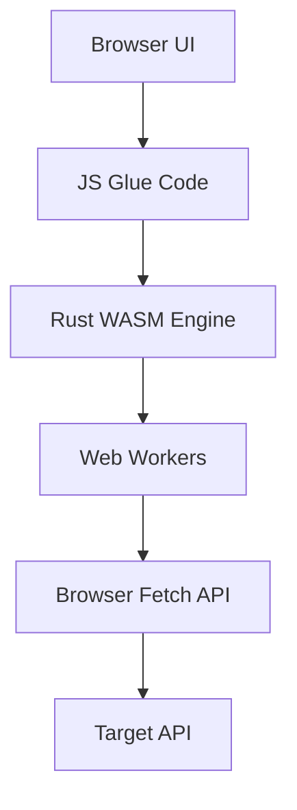

# 🚀 WASM Stress Test Pro

<p align="center">
  
</p>

<p align="center">
  <strong>High-Performance Browser-Native HTTP Stress Testing</strong><br>
  <em>Powered by Rust 🦀 & WebAssembly ⚡</em>
</p>

---

## 🌟 Overview

**WASM Stress Test Pro** is a sophisticated, browser-native utility designed for high-concurrency load testing. Unlike traditional tools, it runs entirely in your browser using a compiled Rust engine, allowing you to simulate massive traffic without installing heavy desktop clients.

### ✨ Key Features
- **🦀 Rust Engine:** Leverages the safety and speed of Rust via WebAssembly.
- **⚡ Multi-Threaded:** Supports Web Workers for parallel execution.
- **📊 Real-time Metrics:** Visualize latency, throughput, and error rates instantly.
- **🔄 Advanced Load Patterns:** Choose from Constant, Ramp-up, Spike, Wave, and more.
- **🛡️ Reliability Controls:** Integrated retries, circuit breakers, and rate limiting.
- **📝 Exportable Reports:** Save your results as structured JSON for analysis.

---

## 🛠️ Integration Guide: Connecting WASM to Your HTML

Integrating this high-performance engine into your own web application is straightforward. Follow these steps:

### 1. File Structure
Ensure you have the following files in your project:
- `wasm_stress.js` (The JavaScript glue code)
- `wasm_stress_bg.wasm` (The compiled binary engine)

### 2. Implementation
Import the initialization function and the core runner from the glue file:

```html
<script type="module">
  // 1. Import the WASM bridge
  import init, { run_stress_test } from './wasm_stress.js';

  async function startEngine() {
    try {
      // 2. Initialize the WASM binary
      await init('./wasm_stress_bg.wasm');
      console.log("🚀 WASM Engine Ready!");

      // 3. Run a sample test
      const results = await run_stress_test(
        'https://api.example.com/health', // Target URL
        100,                              // Total requests
        10,                               // Concurrency
        'GET',                            // Method
        '{}'                              // Headers (JSON string)
        // ... see index.html for full parameter list
      );
      
      console.log("Test Results:", results);
    } catch (error) {
      console.error("Engine failed to start:", error);
    }
  }

  startEngine();
</script>
```

---

## 📱 Mobile Testing & Local Servers

For testing on mobile devices (especially iOS) or local network environments, we recommend using a dedicated local server app to bypass browser security restrictions.

### 🍎 Recommended for iOS
To host your stress test locally on iPhone or iPad, use the **Local Server** app:

[](https://apps.apple.com/app/id6743850070)

**[Download Local Server for iOS](https://apps.apple.com/app/id6743850070)**

---

## 🏗️ Architecture



---

## ⚖️ License & Disclaimer

This tool is for **authorized testing only**. Generating high load against systems you do not own or have permission to test may be illegal and can cause significant service disruption.

> **Note:** Browser security (CORS) applies. Ensure your target server allows requests from the origin where this tool is hosted.

---

<p align="center">
  Made with ❤️ using Rust and WebAssembly
</p>
