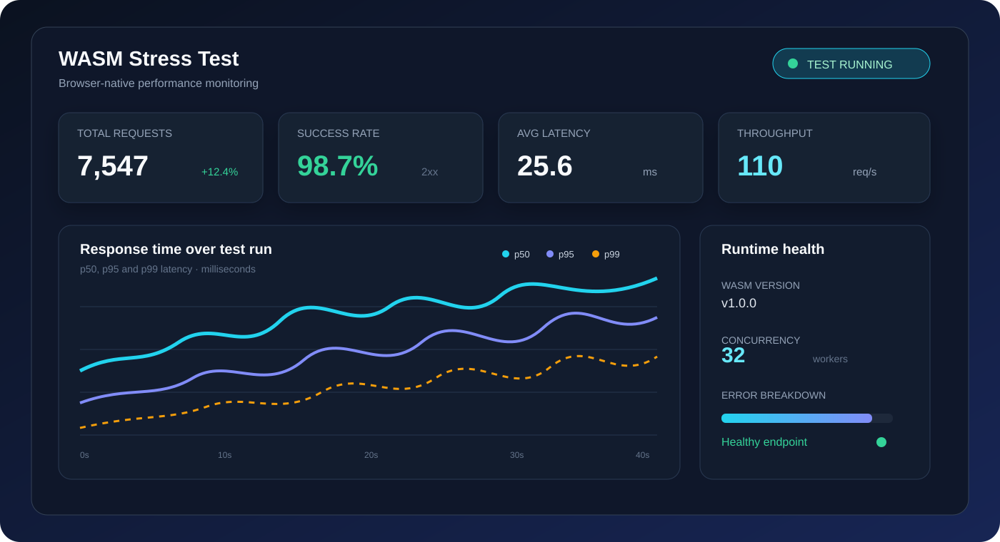
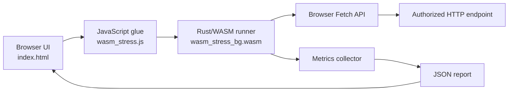

# WASM Stress Test

<p align="center">
  <strong>A browser-native HTTP stress-testing interface powered by Rust and WebAssembly.</strong>
</p>

<p align="center">
  Run controlled load tests, inspect latency and error metrics, and export structured JSON reports without installing a heavyweight desktop load-testing client.
</p>

<p align="center">
  
</p>

> **Illustrative dashboard reference:** the image above demonstrates the type of performance view that this project is designed to complement. The actual application renders its report directly in the browser and exports the collected metrics as JSON.

## Overview

WASM Stress Test is a local browser UI backed by a Rust-compiled WebAssembly runner. It is designed for development, QA, and controlled performance testing of HTTP endpoints that you own or are explicitly authorized to test.

The frontend collects test parameters and displays progress. The Rust/WASM layer performs the requests, applies retry and circuit-breaker policies, gathers latency statistics, and returns a structured report to JavaScript.

## Highlights

| Capability | Description |
|---|---|
| Browser-native execution | Uses the browser Fetch API through WebAssembly. |
| Multiple HTTP methods | Supports `GET`, `POST`, `PUT`, `PATCH`, `DELETE`, `HEAD`, and `OPTIONS`. |
| Configurable concurrency | Controls the number of requests processed concurrently by the WASM runner. |
| Load patterns | Includes constant, ramp-up, spike, wave, step, and random patterns. |
| Request customization | Accepts JSON headers, optional request bodies, redirects, expected text, and optional custom scripts. |
| Reliability controls | Provides rate limiting, retries, circuit breaking, timeouts, and request metadata variation. |
| Metrics | Reports throughput, latency percentiles, standard deviation, TTFB, status distribution, failures, retries, and time-series data. |
| Export | Downloads the latest report as a timestamped JSON file. |

## Architecture



The browser loads the WASM runtime when the page starts. **No target request is sent at page load.** Requests begin only after the user presses **Run test** and the form passes validation.

## Project Files

| File | Purpose |
|---|---|
| `index.html` | User interface, validation, progress display, report merging, and JSON download. |
| `lib.rs` | Rust source for request execution, metrics, retries, rate limiting, circuit breaking, and report generation. |
| `wasm_stress.js` | JavaScript glue generated for the Rust/WASM module. |
| `wasm_stress_bg.wasm` | Compiled WebAssembly binary. |
| `load-test-dashboard.svg` | Illustrative dashboard image used in this README. |

## Getting Started

### 1. Prepare the web files

Place the HTML, JavaScript glue, and WebAssembly binary in the same directory. The current HTML import paths expect the generated runtime files to be named:

```text
stress_wasm.js
stress_wasm_bg.wasm
```

The supplied artifacts are named:

```text
wasm_stress.js
wasm_stress_bg.wasm
```

Rename the two runtime artifacts to match the HTML paths, or update the import and initialization paths in `index.html` before serving the application.

### How WebAssembly connects to your own JavaScript

The generated JavaScript glue file is the bridge between your application code and the compiled Rust binary. You do not import the `.wasm` file as a normal JavaScript module. Instead, import the default `init` function and the named Rust exports from the glue file, then call `init()` once before using any exported function.

For the supplied artifact names, a minimal integration looks like this:

```html
<script type="module">
  import init, { run_stress_test, version } from './wasm_stress.js';

  async function loadWasm() {
    // The glue file fetches and instantiates the matching binary.
    await init('./wasm_stress_bg.wasm');
    console.log('WASM version:', version());
  }

  async function runExample() {
    await loadWasm();

    const report = await run_stress_test(
      'https://your-authorized-endpoint.example/health',
      10,                         // total_requests
      2,                          // concurrency
      'GET',                      // method
      '{}',                       // headers_json
      undefined,                  // body
      3000,                       // timeout_ms
      true,                       // follow_redirects
      'constant',                 // load_pattern
      200,                        // expected_status; 0 disables exact check
      '',                         // expected_text
      '',                         // custom_script
      (completed) => console.log('Completed:', completed),
      undefined, undefined, 3,   // rate limit, circuit threshold, retries
      undefined, undefined, undefined, undefined, undefined,
      30000, 250, 3000,          // wait and retry delays
      BigInt(30000), 20, BigInt(60000),
      true,                      // reset circuit window after probe success
      true                       // enable template rendering
    );

    console.log('Stress-test report:', report);
  }

  runExample().catch(console.error);
</script>
```

The matching binary path is passed to `init()`. If both files are served from the same directory, the relative paths above work as written. If the binary is hosted elsewhere, pass its absolute or URL-relative path instead:

```js
await init('/assets/wasm/wasm_stress_bg.wasm');
```

The initialization step should normally run once and be shared by the rest of the application:

```js
import init, { run_stress_test } from './wasm_stress.js';

const wasmReady = init('./wasm_stress_bg.wasm');

export async function runLoadTest(options) {
  await wasmReady;
  return run_stress_test(
    options.url,
    options.totalRequests,
    options.concurrency,
    options.method ?? 'GET',
    JSON.stringify(options.headers ?? {}),
    options.body,
    options.timeoutMs ?? 3000,
    options.followRedirects ?? true,
    options.loadPattern ?? 'constant',
    options.expectedStatus ?? 200,
    options.expectedText ?? '',
    options.customScript ?? '',
    options.onProgress ?? (() => {}),
    options.rateLimit,
    options.circuitThreshold,
    options.retryAttempts,
    options.rotateUserAgent,
    options.wafBypass,
    options.wafCacheBuster,
    options.wafXffRotation,
    options.wafRandomHeaders,
    options.rateLimitMaxWaitMs,
    options.retryBaseDelayMs,
    options.retryMaxDelayMs,
    options.circuitTimeoutMs === undefined ? undefined : BigInt(options.circuitTimeoutMs),
    options.circuitWindowSize,
    options.circuitWindowMs === undefined ? undefined : BigInt(options.circuitWindowMs),
    options.resetWindowOnProbeSuccess,
    options.enableTemplating
  );
}
```

The exported function returns a Promise. Its progress callback receives the completed-request count during execution, while the resolved value is the final report object. The wrapper above keeps the long positional ABI in one place so application code can use named options.

#### File naming: use one consistent pair

The HTML currently references `stress_wasm.js` and `stress_wasm_bg.wasm`, while the supplied files are named `wasm_stress.js` and `wasm_stress_bg.wasm`. Choose either of these two valid arrangements:

| Arrangement | JavaScript import | `init()` binary path |
|---|---|---|
| Keep supplied names | `./wasm_stress.js` | `./wasm_stress_bg.wasm` |
| Keep current HTML paths | `./stress_wasm.js` | `./stress_wasm_bg.wasm` |

The JavaScript glue and `.wasm` binary must come from the same Rust build. Do not mix a glue file from one build with a binary from another build.

### 2. Serve the directory over HTTP

WebAssembly modules and ES modules should be served through a local HTTP server rather than opened directly with a `file://` URL.

For example:

```bash
python3 -m http.server 8080 --directory .
```

Then open:

```text
http://localhost:8080/index.html
```

### 3. Configure a test

Enter an authorized HTTP or HTTPS endpoint, choose the request method, set the request time and concurrency, and optionally configure headers, a body, expected response text, or advanced reliability controls.

For JSON requests, a typical configuration is:

```json
{
  "Content-Type": "application/json",
  "Accept": "application/json"
}
```

Use a request body only with methods and endpoints that are designed to accept one. In particular, a `GET` request normally should not include a body.

## Report Model

The exported report contains fields such as:

| Metric group | Representative fields |
|---|---|
| Volume | `total_requests`, `successful_requests`, `failed_requests` |
| Timing | `min_latency_ms`, `avg_latency_ms`, `max_latency_ms`, `p50_latency_ms`, `p95_latency_ms`, `p99_latency_ms` |
| Distribution | `latency_percentiles`, `std_dev_latency_ms`, `time_series` |
| Throughput | `throughput_per_second`, `total_time_ms` |
| Reliability | `retry_attempts`, `timeout_count`, `network_error_count`, `rate_limit_hits` |
| Circuit breaker | `circuit_open_events`, `circuit_blocked_requests` |
| HTTP results | `status_code_distribution`, `error_breakdown`, `error_details` |

The **Download report** button saves the most recent report as a JSON file, making it suitable for archival, CI attachments, or follow-up analysis.

## Load Patterns

The load-pattern selector changes how delays are calculated across the request sequence.

| Pattern | Intended behavior |
|---|---|
| `constant` | No pattern-specific delay. |
| `ramp-up` | Gradually increases delay over the request sequence. |
| `spike` | Creates a concentrated high-load region. |
| `wave` | Applies a periodic wave-shaped delay. |
| `step` | Changes delay in discrete steps. |
| `random` | Applies a randomized delay. |

## Security and Safety Notes

Only test systems for which you have explicit authorization. Load testing can affect availability, cost, rate limits, logs, and downstream services.

The optional custom-script field executes JavaScript supplied by the user. Do not paste scripts from untrusted sources. Review headers, request bodies, concurrency, request time, and retry settings before starting a test.

Browser security policies still apply. Cross-origin requests may be blocked by CORS, and the application cannot bypass a server's browser access policy. A failed browser request may therefore indicate a CORS or network restriction rather than an application defect.

The request-header variation controls are disabled unless the main variation option is enabled. Keep the advanced controls at their safe defaults unless the test plan requires otherwise.

## Current Behavior and Limitations

The current WASM runner is request-count based. The frontend uses the configured request time to drive repeated small batches, but a request-time value does not guarantee an exact continuous wall-clock run. The total number of requests depends on concurrency, request latency, timeout settings, and the number of batches completed before the deadline.

The report merges the results from completed batches. A final in-flight batch may finish after the requested UI duration before its metrics are included in the final report.

The runtime artifacts must be rebuilt together with the Rust source whenever the exported WASM ABI changes. Editing `lib.rs` alone does not update the already compiled `.wasm` binary.

## Development Notes

When changing the Rust exports, regenerate all matching WebAssembly artifacts, including the JavaScript glue file and binary. Keep the generated files version-aligned and update the cache-busting query string in the HTML when deploying a new build.

For repeatable testing, use a dedicated test endpoint, start with low concurrency, monitor server-side metrics, and increase load gradually. Compare client-side results with server logs and infrastructure metrics before drawing conclusions.
